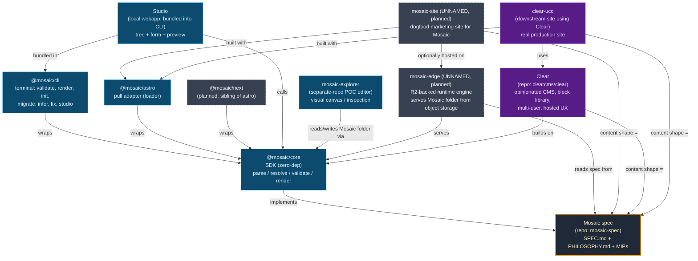

# Mosaic Ecosystem

A map of every project, package, and product in or around the Mosaic format. Read this when you can't remember where something lives, what it depends on, or whether a new idea overlaps with an existing one.

Last updated 2026-05-15, against spec version 0.9 (in flight from 0.8.1).

---

## 1. Dependency diagram

Solid boxes = exists today. Dashed boxes = planned / unnamed.

---

## 2. Node-by-node description

### Mosaic spec (`mosaic-spec` repo)
**What it is.** The format specification. Plain text: `SPEC.md` (RFC-2119 rules), `PHILOSOPHY.md` (foundational claims), `mips/` (decision records), `mosaic.schema.json` (JSON Schema validator), `examples/`, `tests/` (conformance suite).
**What it isn't.** Not a framework, not a CMS, not a runtime. It defines folder shape — nothing more.
**Depends on.** Nothing. Pure prose plus JSON Schema. The spec is the root of the tree.
**Lives at.** `/home/ms/active/mosaic-spec/mosaic-spec/`.

### `@mosaic/core`
**What it is.** Reference SDK. Functions you `import`: parse a manifest, resolve `ref:` chains, validate against the spec, render to basic HTML, walk collections. ~2100 LOC, zero runtime deps (only `marked` for now, moving inline to hit true zero).
**What it isn't.** Not a CLI, not a server, not a UI. Pure library.
**Depends on.** Spec (conceptually). Node stdlib only.
**Lives at.** `mosaic-spec/tools/core/` (monorepo through 0.9, possibly split at 1.0).

### `@mosaic/cli`
**What it is.** Single terminal binary. Subcommands: `validate`, `render`, `init`, `migrate`, `infer`, `fix`, `studio`, plus `explore` later. Mirrors core's SDK actions through a terminal interface.
**What it isn't.** Not a daemon, not a build tool, not a deployer. It runs once per invocation against a folder.
**Depends on.** `@mosaic/core`. Bundles Studio.
**Lives at.** `mosaic-spec/tools/cli/` (under construction; consolidation from `tools/validate/`, `tools/render/`, etc. is the next consolidation step).

### `@mosaic/astro`
**What it is.** Astro content loader. Pull adapter: reads a Mosaic folder, hands records to Astro's content collection API. Powers clear-ucc today (127 HTML pages).
**What it isn't.** Not a build plugin, not a Vite integration, not a routing layer. It plugs into Astro's existing loader contract.
**Depends on.** `@mosaic/core` (peer-deps `astro`).
**Lives at.** `mosaic-spec/tools/astro/`.

### `@mosaic/next` *(planned, not yet built)*
**What it is.** Same idea as `@mosaic/astro`, for Next.js. Validates the claim that core is framework-agnostic.
**What it isn't.** Not a Vercel adapter, not a deploy target. Pure data-loader sibling of astro.
**Depends on.** `@mosaic/core` (peer-deps `next`).
**Status.** On the priority list after CLI consolidation.

### Studio
**What it is.** Local webapp bundled inside `@mosaic/cli`. Runs via `mosaic studio --site ./content`. Tree view + form editor + live preview iframe + click-to-highlight via `data-mosaic-source`. Plain HTML + vanilla JS (+ maybe `htm`). No React.
**What it isn't.** Not a hosted editor. Not multi-user. Not a canvas / visual-page-builder. Not a separate package. That last one is load-bearing: bundling into CLI keeps the package count at three.
**Depends on.** `@mosaic/core` (SDK calls), `@mosaic/cli` (shell). Browser is delivery, not dependency.

### mosaic-explorer *(separate-repo POC editor)*
**What it is.** Experimental visual editor — separate repo, more ambitious UI surface than Studio. Inspect / explore / shallow-edit a Mosaic folder with a richer canvas than the form-based Studio.
**What it isn't.** Not the canonical Studio. Not part of `@mosaic/cli`. POC for ideas that may or may not migrate into Studio or into Clear.
**Depends on.** `@mosaic/core` (reads/writes Mosaic folders through the SDK).
**Role.** Sandbox. If a UX idea earns its keep here, it graduates to Studio (if minimal) or Clear (if rich).

### mosaic-edge *(planned, name TBD — see Naming gaps)*
**What it is.** Runtime engine that serves a Mosaic folder from Cloudflare R2 (object storage) without a build step. Edge worker fetches manifest, resolves refs, renders HTML, returns response.
**What it isn't.** Not a CDN, not a build target, not a static export. It's a live server that treats R2 as the filesystem.
**Depends on.** `@mosaic/core`, R2 bindings, a CF Worker runtime.
**Why it might exist.** Lets non-Astro / non-Next sites run Mosaic without a framework. Targets the "drop a folder on object storage, get a live site" promise.

### mosaic-site *(planned, name TBD — see Naming gaps)*
**What it is.** The marketing / docs / showcase website for Mosaic itself. Dogfood: built from a Mosaic folder, using `@mosaic/astro`, possibly served via mosaic-edge.
**What it isn't.** Not the spec repo. Not internal docs. It's the public face — `mosaic.dev` or equivalent.
**Depends on.** Spec (content shape), `@mosaic/astro` (or mosaic-edge), Studio (for editing).

### Clear (`clearcms/clear`)
**What it is.** Downstream CMS product. Opinionated block library + multi-user + versioning + hosted UX + visual page-builder canvas. Builds on Mosaic's substrate but ships a productized editor experience.
**What it isn't.** Not a Mosaic package, not a Mosaic adapter. It's a separate product that *uses* Mosaic the way an Astro site uses Markdown.
**Depends on.** `@mosaic/core`, the spec.
**Role.** Mosaic = substrate (open, dep-free, format-only). Clear = product (polished, hosted, multi-user, paid-ish).

### clear-ucc
**What it is.** Real production site built on Clear (and Astro via `@mosaic/astro`). A non-profit community site — and the first end-to-end POC of the Mosaic → Astro path. Currently on Vercel; migrating to Cloudflare Pages.
**What it isn't.** Not a template, not a starter. Single production site.
**Depends on.** Clear (downstream UX), `@mosaic/astro` (data loader), spec (folder shape).
**Lives at.** `/home/ms/clear-ucc-mosaic/` (writable fork). Source-of-truth read-only mirror at `/home/ms/clear-ucc-ref/` — never commit there.

---

## 3. No-overlap analysis

### Mosaic spec vs Clear
**Different because.** Mosaic defines a folder. Clear defines an editing experience plus a block vocabulary. A Mosaic folder is valid whether or not Clear ever touches it; a Clear install only makes sense on top of a Mosaic folder. Mosaic ages on the scale of a file format (decades); Clear ages on the scale of a SaaS product (years).
**Both exist because.** Substrate and product solve different problems. Other tools may build on Mosaic without buying Clear's opinions. Clear gets the lock-in-free pitch *for free* by virtue of standing on Mosaic.

### Studio vs Clear's admin
**Different because.** Studio is the reference editor: minimal, local-only, form-based, bundled in CLI. Single-user, single-folder. No canvas, no permissions, no versioning. Clear's admin is the productized editor: hosted, multi-user, canvas-style block building, versioning, opinionated block library.
**Both exist because.** Studio proves the SDK is editable and ships a usable local editor for developers and solo authors. Clear's admin is where the UX investment goes for non-developer end users. If Studio grew into Clear, the spec repo would inherit product weight; that's exactly what the architecture forbids.

### Studio vs mosaic-explorer
**Different because.** Studio is the canonical, shipped editor (inside CLI). mosaic-explorer is a separate-repo POC — looser, more experimental, probably canvas-y. Studio is the production reference; mosaic-explorer is the ideation lab.
**Both exist because.** Mosaic ships one official editor (Studio) so consumers know what's blessed. The POC lives outside that contract so it can break things. Ideas earned in explorer either fold into Studio (minimal additions) or migrate to Clear (rich features).
**Risk.** If both keep growing in scope, they collide. Decision rule: if explorer's feature would need React, canvas, or multi-user, it belongs in Clear, not Studio.

### `@mosaic/astro` vs mosaic-edge
**Different because.** `@mosaic/astro` is a pull adapter inside someone else's build pipeline (Astro). It runs at build time on the developer's machine or CI. mosaic-edge is a standalone runtime that serves Mosaic content directly, with no build step and no framework. The first turns Mosaic into Astro pages; the second turns Mosaic into HTTP responses.
**Both exist because.** Two consumption patterns: framework-integrated (Astro/Next users) vs framework-free (drop folder in R2, get a site).

### mosaic-site vs clear-ucc
**Different because.** mosaic-site is the *project's own* showcase — markets Mosaic the format, dogfoods the toolchain. clear-ucc is a *customer's* site, happens to be built on Clear+Mosaic. mosaic-site is owned by the spec project; clear-ucc is owned by the community group.
**Both exist because.** Distinct audiences (developers looking at Mosaic vs visitors to a community site). Sharing infrastructure is fine; sharing identity is not.

### `@mosaic/cli` vs `@mosaic/core`
**Different because.** Core is the library you import in code. CLI is the binary you invoke from a shell. CLI's only logic is argument parsing + I/O + pretty printing; the work is all in core.
**Both exist because.** Different surfaces for different consumers. Build tools want imports; humans want commands.

---

## 4. Naming gaps

Things the ecosystem implies but the user hasn't named yet. Pick one per gap; ship the name in this doc when chosen.

### Gap 1: the R2-backed runtime engine
Currently referred to as "mosaic-edge" or "the R2 engine."
- **`@mosaic/edge`** — fits the package namespace. Clear cloud-runtime connotation.
- **`@mosaic/serve`** — verb-named, sibling to `@mosaic/render`. Says what it does.
- **`mosaic-host`** — standalone repo name, not a package; reads well as "Mosaic's reference host."

Recommendation: **`@mosaic/edge`** if it ships as a worker library; **`mosaic-host`** if it ships as a deployable app.

### Gap 2: the dogfood website for Mosaic
Currently referred to as "mosaic-site."
- **`mosaic.dev`** (the site itself + repo named after the domain).
- **`mosaic-www`** — explicit "this is the website repo" convention.
- **`mosaic-showcase`** — emphasizes the demo role over the marketing role.

Recommendation: **`mosaic.dev`** as the domain, **`mosaic-www`** as the repo. Keep showcase content inside, don't split repos.

### Gap 3: the visual editor lineage
mosaic-explorer exists as a POC repo. If it graduates, what does it become?
- **Keep `mosaic-explorer`** if it stays a POC and never becomes canonical.
- **`@mosaic/studio-canvas`** — extension on top of Studio if the canvas idea proves out.
- **fold into Clear** — if it grows multi-user / hosted features, it stops being Mosaic territory by definition.

Recommendation: leave the name as-is until it earns a graduation. Don't pre-name a future that may not arrive.

### Gap 4: the conformance test harness
The `tests/` folder runs against `@mosaic/core` today. If implementers want a standalone harness, it needs a name.
- **`@mosaic/conformance`** — package containing the test corpus + runner.
- **`mosaic-test-suite`** — standalone repo, like Web Platform Tests.

Recommendation: **`@mosaic/conformance`**, kept inside the spec monorepo through 1.0.

### Gap 5: AI translation / content tooling
Referenced in the prior handoff as future `mosaic translate --target uk`. Not part of CLI core.
- **`@mosaic/translate`** — package, plugin to CLI.
- **`mosaic-ai`** — broader bucket for AI-assisted tooling (translate, draft, infer types from examples).

Recommendation: **`@mosaic/translate`** when it ships. Don't pre-create `mosaic-ai` — that bucket invites scope creep.

---

## 5. License recommendations

The split here is deliberate: substrate stays maximally permissive; products carry stronger contributor protections.

| Node | License | Reason |
| --- | --- | --- |
| Mosaic spec (prose: SPEC, PHILOSOPHY, MIPs) | **CC-BY 4.0** | It's a specification, not code. CC-BY is the format the IETF/W3C/CommonMark world uses for spec text. Allows commercial reuse with attribution. |
| `mosaic.schema.json`, examples, tests | **MIT** | Code-shaped artifacts in the spec repo. Lowest-friction permissive license — matches the rest of the SDK. |
| `@mosaic/core` | **MIT** | Substrate library. Maximum adoption. Current spec repo license is MIT. |
| `@mosaic/cli` | **MIT** | Same reason as core. |
| `@mosaic/astro` | **MIT** | Adapter. Must be as permissive as Astro's ecosystem expects. |
| `@mosaic/next` (planned) | **MIT** | Same. |
| Studio (inside CLI) | **MIT** | Bundled with CLI; inherits CLI's license. |
| mosaic-explorer | **MIT** | POC; permissive while the shape is moving. Reconsider if it grows. |
| mosaic-edge (planned) | **MIT** or **Apache 2.0** | If it stays substrate-shaped: MIT. If it ships as a deployable platform competing with CMS hosts: **Apache 2.0** for the patent grant. |
| mosaic-site (dogfood) | **MIT** (code) + **CC-BY 4.0** (content) | Standard split for a project website. |
| Clear (`clearcms/clear`) | **Apache 2.0** | Product with potential commercial competitors. Apache's explicit patent grant matters once Clear is something other companies might fork. |
| clear-ucc | **AGPL-3.0** or **proprietary** | A real production site; the actual content is the org's, not open-source. Whatever license fits the community group's policy. The Mosaic *folder* inside it is just data. |

Rule of thumb across the board: **MIT for libraries, Apache 2.0 for products, CC-BY for spec text, project-call for real customer sites.** Don't mix MIT and Apache inside a single package — pick once per node.

---

## Quick reference: where each thing lives

| Thing | Path / location | Status |
| --- | --- | --- |
| Mosaic spec | `/home/ms/active/mosaic-spec/mosaic-spec/` | 0.9 in flight |
| `@mosaic/core` | `mosaic-spec/tools/core/` | shipped |
| `@mosaic/cli` | `mosaic-spec/tools/cli/` (consolidating) | under construction |
| `@mosaic/astro` | `mosaic-spec/tools/astro/` | shipped, powers clear-ucc |
| `@mosaic/next` | not yet created | planned |
| Studio | `mosaic-spec/tools/cli/studio/` (bundled) | Tier 1 planned |
| mosaic-explorer | separate repo | POC |
| mosaic-edge | not yet created | planned, unnamed |
| mosaic-site | not yet created | planned, unnamed |
| Clear | `clearcms/clear` (separate org) | downstream product |
| clear-ucc (fork) | `/home/ms/clear-ucc-mosaic/` | production POC |
| clear-ucc (ref, read-only) | `/home/ms/clear-ucc-ref/` | never commit here |
